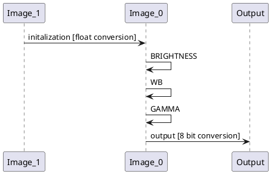
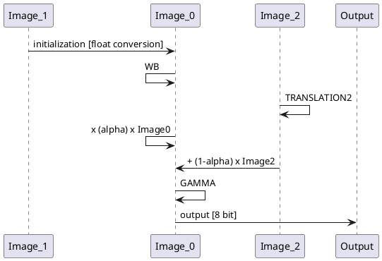

# Aerial drone photography project

# General information
* Author : Balthazar Neveu , Alain Neveu

# Application for botanists

### Sample test
2 ways to run the sample
* simply use `customApplication.py` to run a file browser which will allow you to select your excel file, the search [SampleMission/FlightPath.xslx](SampleMission/FlightPath.xslx) .
* Use `customApplication.py --excel SampleMission/FlightPath.xlsx`

## Content
2 cameras are used:
* drone visible camera
* IR camera

`Camera type`: type is located in th exif, open file details and search camera model
`Timelapse`: provides the interval between each photo in seconds
`deltatime`: provides an offset between the two cameras timestamps.
In the sample folder, you'll find image examples, deltatime is ~ 15 seconds.
# Image registration code
* Images from the drone are nearly distorsion-less
* Images from the fisheye IR camera have a much wider field of view and distorsions

Image registration works in the following manner:
* undistort IR image
* computes feature (*SIFT*) points on 2 thumbnails (800x600) of visible & undistorted IR image in grey levels
* matches features points (*Flann*)
* estimates homography between the two set of matched points
* allows for full resolution (not thumbnail) warp of the IR image onto the visible full resolution image.

# Camera calibration
* camera calibrations are pre-stored in the calibration/mycamera folder
* when using a new camera:
  * to get a planar checkerboard, either print or display on your computer screen  [Generator "8x11"](https://calib.io/pages/camera-calibration-pattern-generator)
  * shoot about 30 images of the checkerboard in various camera orientations (refer to [openCV Zhang's camera calibration](https://docs.opencv.org/master/dc/dbb/tutorial_py_calibration.html)
  * put all images in `calibration/mynewcamera`
  * `calibnewcam = irdrone.utils.cameracalibration(camera="mynewcamera", checkerboardsize=(10,7))` will take care of camera calibration
* camera calibration is located  [irdrone.calibration](irdrone/cameracalibration.py)  for more details to calibrate your new camera


# Testing
```pytest irdrone\test.py```

# Image processing and visualization features
## Demo content
Run [demo.py](demo.py) to test the image processing features.

### I/O management
* [irdrone.process](irdrone/process.py) contains helpers
  * load images from disk
  * compare images in a side by side or grid fashion
  
```
import irdrone.process as pr
import irdrone.utils   as ut
pr.show(
    [
        [(ut.testimage(xsize=200, ysize=200, sat=sat ), "color rectangle %.1f"%sat) for sat in [0.1, 0.5]],
        [(ut.testimage(xsize=300, ysize=200, sat=sat), "wide %.1f"%sat) for sat in [0.3, 0.5, 1.]]
    ],
    suptitle="Comparison grid"
)
```


# Image processing pipeline
[irdrone.imagepipe.Imagepipe](irdrone/imagepipe.py) class is designed to build a simple image processing pipeline
* multiple inputs support
* configured through parameters which can be tuned with GUI sliders
* use the `.gui()` method to launch interactive tuning
* when the GUI is launched, you can use 
    * `S` to save the current image at full resolution
    * `I` to print the current tuning parameters values
    * `Q` to close the window
    * `R` to reset the parameters

Simple language is used to describe the sequence of processings.
### Example
```
imgl = [utils.testimage(xsize=720, ysize=720),]
ipBasicLinPipe = imagepipe.ImagePipe(
    imgl,
    sliders=[imagepipe.BRIGHTNESS, imagepipe.WB, imagepipe.GAMMA],
).gui()
```

Will create an image processing pipeline where first, 
* all channels can first be amplified through the brightness slider.
* then white balance can be applied (separate multiplications on blue and red channels)
* and finally a gamma tone curve is applied



### Multi-image processing
```
TRANSLATION2 = Translation("T_IMAGE2", slidersName=["TX im2", "TY im2"], inputs=[2,], outputs=[2,], vrange=(-50.,50.,0.))
imgl = [utils.testimage(xsize=720, ysize=720, sat=sat) for sat in [1., 0.]]
ip = ImagePipe(imgl, sliders=[WB, TRANSLATION2, ALPHA, GAMMA]).gui()
```
* `imagelist[0]` is used for recursive processing.
* Take a careful look at the instanciation of `TRANSLATION2` , `inputs=[2,], outputs=[2,]` are given in order to select 
  which images to apply the processingBlock to and where to redirect the output.
  



